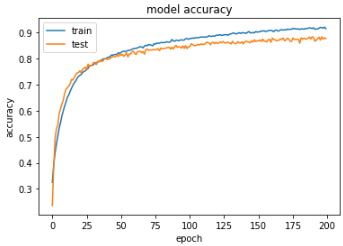

# Repositorio de Reconocimiento de Emociones a partir de Señales EEG

Directamente a   Ver resultados

Resultados de modelos relacionados

## Trabajos Relacionados

### 1. Emotion Recognition from EEG Signals Using Multidimensional Information in EMD Domain

**Descripción:** Este trabajo propone un método para la extracción de características y el reconocimiento de emociones basado en la descomposición modal empírica (EMD). Utiliza información multidimensional de las funciones de modo intrínseco (IMFs) como características para el reconocimiento de emociones.

**Solución:** El método utiliza EMD para descomponer las señales EEG en IMFs y extrae características multidimensionales para alimentar un clasificador SVM. Este enfoque mejora la precisión del reconocimiento de emociones al capturar información más detallada de las señales EEG.

[Link Paper](https://onlinelibrary.wiley.com/doi/10.1155/2017/8317357)

#### Resultados obtenidos

La ejecución de esta implementación se encuentra en el siguiente notebook utilizando el dataset DEAP utilizando en 200 épocas

[Link Colab](https://colab.research.google.com/drive/1WrATP0vMAtg0CexIkO7k335cPNExIUkE?usp=sharing)

### 2. Multi-Task CNN model for emotion recognition from EEG Brain maps

**Descripción:** Este artículo presenta un modelo de Red Neuronal Convolucional (CNN) de múltiples tareas para el reconocimiento de emociones a partir de mapas cerebrales creados a partir de señales EEG. Utiliza características como la entropía diferencial (DE) y la densidad espectral de potencia (PSD).

**Solución:** El modelo CNN de múltiples tareas se alimenta con mapas cerebrales que representan características de las señales EEG, lo que permite una clasificación más precisa de las emociones en términos de valencia y arousal. Este enfoque aprovecha la capacidad de las CNN para analizar datos espacialmente distribuidos.

[Link Paper](https://www.researchgate.net/publication/356727064_Multi-Task_CNN_model_for_emotion_recognition_from_EEG_Brain_maps)

#### Resultados obtenidos

La ejecución de esta implementación se encuentra en el siguiente notebook utilizando el dataset DEAP utilizando en 200 épocas con unos resultados en test de 82.5%

[Link Colab](https://colab.research.google.com/drive/1PylfW9CCpFXbsfmkFgX_yyUH3wmR2aDn#scrollTo=4ZgJPO-bvo4B)

### 3. Multi-class Emotion Classification Using EEG Signals

**Descripción:** Este trabajo compara modelos de aprendizaje profundo, específicamente LSTM y CNN, para la clasificación de emociones utilizando señales EEG. Evalúa diferentes divisiones de conjuntos de datos de entrenamiento y prueba para determinar cuál de estos modelos ofrece una mayor precisión en la clasificación de emociones.

**Solución:** Utiliza modelos LSTM y CNN para clasificar emociones a partir de señales EEG, logrando precisiones de 88.60% y 87.72%, respectivamente. Este enfoque demuestra la efectividad de los modelos de aprendizaje profundo en el reconocimiento de emociones.

[Link Paper](https://link.springer.com/chapter/10.1007/978-981-16-0401-0_38)

## Tabla Comparativa

| Trabajo | Método | Precisión | Dataset | Enfoque Principal |
| --- | --- | --- | --- | --- |
| Emotion Recognition from EEG Signals Using Multidimensional Information in EMD Domain | EMD + SVM | ~70.41% (Valencia), ~72.10% (Arousal) | DEAP | Extracción de características multidimensionales |
| Multi-Task CNN model for emotion recognition from EEG Brain maps | CNN Multi-Tarea | 96.28% (Valencia), 96.62% (Arousal) | DEAP | Mapas cerebrales y aprendizaje multi-tarea |
| Multi-class Emotion Classification Using EEG Signals | LSTM, CNN | 88.60% (LSTM), 87.72% (CNN) | DEAP | Comparación de modelos de aprendizaje profundo |

## Dataset DEAP

### Descripción del Dataset

El conjunto de datos DEAP (Database for Emotion Analysis using Physiological signals) es una colección de señales fisiológicas que se utiliza ampliamente en la investigación de reconocimiento de emociones. Este dataset fue creado para facilitar el análisis de emociones utilizando señales fisiológicas, incluyendo señales EEG y otras señales periféricas.

### Composición del Dataset

El dataset DEAP se compone de los siguientes elementos clave:

- **Participantes:** Incluye datos de 32 participantes.
- **Señales EEG:** Las señales EEG fueron registradas utilizando un dispositivo Biosemi ActiveTwo de 32 canales, siguiendo el sistema internacional 10-20 para la colocación de electrodos.
- **Estímulos:** Los participantes vieron 40 videos musicales diferentes, cada uno con una duración de 1 minuto. Estos videos fueron seleccionados para evocar una amplia gama de emociones.
- **Etiquetas de Emoción:** Después de cada video, los participantes calificaron sus emociones en términos de valencia (de desagradable a agradable) y arousal (de inactivo a activo) en una escala del 1 al 9.
- **Preprocesamiento:** Las señales EEG fueron preprocesadas para eliminar el ruido utilizando registros EMG y EOG, y se aplicó un filtro de paso de banda entre 4 Hz y 45 Hz. Además, las señales fueron submuestreadas a 128 Hz.

### Importancia en las Investigaciones

El dataset DEAP es crucial para la investigación en reconocimiento de emociones por varias razones:

- **Estandarización:** Proporciona un conjunto de datos estandarizado que permite la comparación directa de diferentes métodos y modelos de reconocimiento de emociones.
- **Completitud:** Incluye una amplia variedad de señales fisiológicas y emocionales, lo que permite una evaluación exhaustiva de los modelos.
- **Accesibilidad:** Al ser un conjunto de datos público, facilita la replicación y validación de los resultados de investigación por parte de otros científicos.

### Necesidad en tu Investigación

Utilizar el dataset DEAP en tu investigación es esencial por las siguientes razones:

- **Comparabilidad:** Permite comparar tus resultados con los de otros estudios que también han utilizado este dataset, proporcionando un punto de referencia claro para evaluar el rendimiento de tus modelos.
- **Riqueza de Datos:** La variedad y calidad de los datos en DEAP permiten entrenar y probar modelos de manera robusta, asegurando que los resultados sean generalizables y confiables.
- **Enfoque en Emociones:** Al estar específicamente diseñado para el análisis de emociones, DEAP proporciona las etiquetas y características necesarias para desarrollar y evaluar modelos de reconocimiento de emociones de manera efectiva.

Más información en [Deap Dataset](https://www.eecs.qmul.ac.uk/mmv/datasets/deap/)